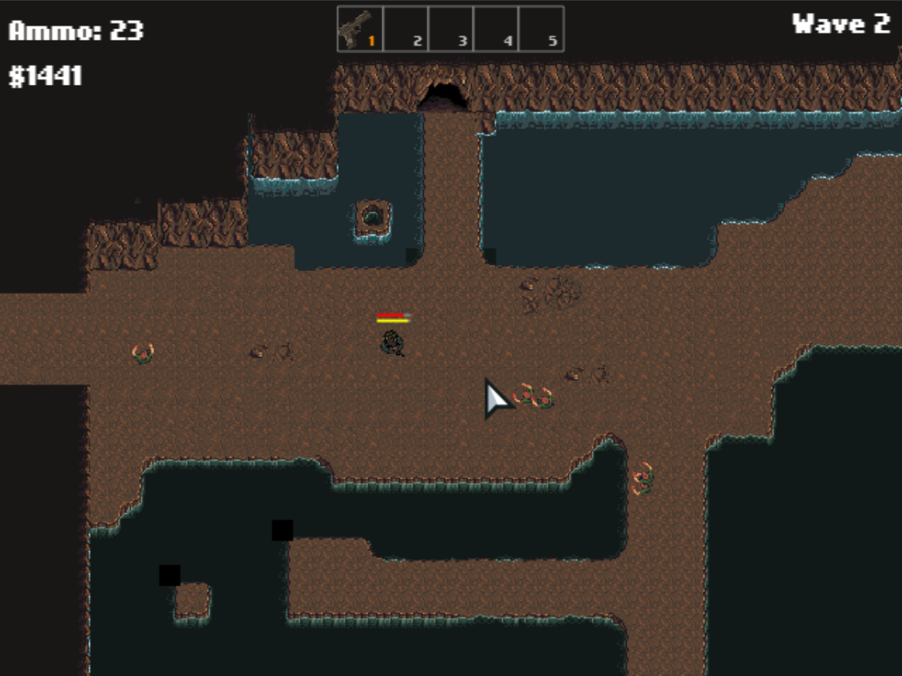
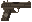
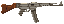
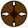

## Zombie Killer

Aluno: Artur Constanzi Sponchiado  
Matrícula: 1611100014  

URL para jogar: https://arturspon.github.io/zombie-killer/  

## O jogo
Você é um sobrevivente de um apocalipse zumbi, seu passatempo agora é matar o máximo de zumbis possíveis.  
Todavia, em uma de suas aventuras, você ficou preso em uma caverna cheia de mortos-vivos, sobreviva o máximo que conseguir!  Não se esqueça de comprar novas armas e minas terrestres para lhe ajudar!  

## Instruções
* Movimente-se com ***W A S D***, mantendo ***SHIFT*** apertado para correr
* Atire ou coloque itens no chão com o ***botão esquerdo do mouse***  
* Utilize os botões ***1, 2, 3, 4 e 5*** para trocar de itens em seu inventário  
* Ganhe dinheiro matando os zumbis (com armas) e compre novos itens acessando a loja com o botão ***B***.  
* Você tem 5 segundos entre cada onda de zumbis para descansar  
* Sua vida (barra vermelha em cima do jogador) e stamina (barra amarela em cima do jogador) voltam com o tempo  
* Você pode comprar uma mina terrestre na loja, ela é barata e mata muitos zumbis instantaneamente, porém, não lhe dá dinheiro, use com sabedoria!

## Itens
| Item | Descrição |
| --- | --- |
|  | Pistola inicial, ela tem no máximo 30 balas e recupera 1 bala a cada 1.5 segundos. |
|  | O rifle pode ser comprado na loja e custa $2700, ele dispara projéteis a uma taxa de 666 RPM. |
|  | A mina terreste pode ser comprada por $500, causa grande dano em um determinado raio, porém não lhe dá dinheiro ao matar seus inimigos. |

## Licença
[MIT](https://choosealicense.com/licenses/mit/)